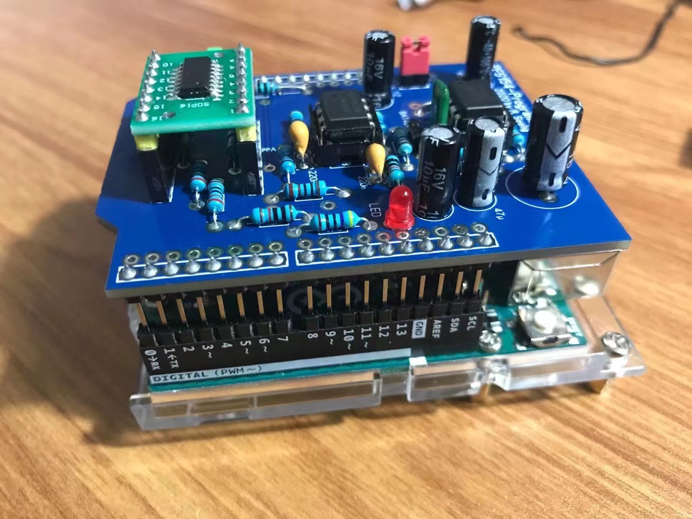
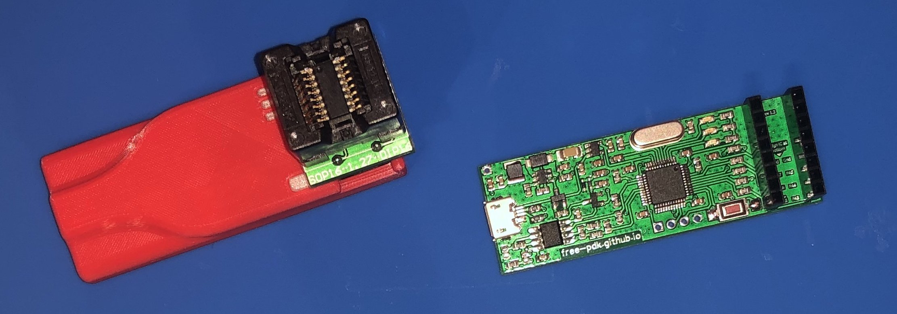
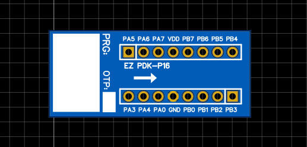
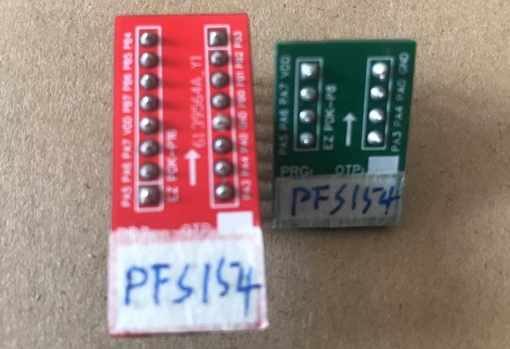
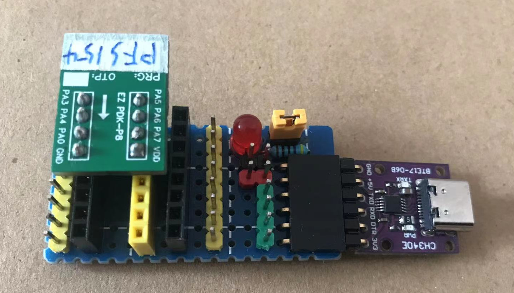

# Opensource toolchain tutorial for Padauk MCU

> PADAUK Technology Co., Ltd. founded in Feb of 2005 and we are devoted to make development of microcontroller as company core. We insist on having our own IP and development system(IDE/ICE), also the Writer is
> self-developed in order to make sure whole technology can be fully grasped. Therefore, it’s available to provide better design performance and programming flexibility issues which can supply perfect solution and meet inquiry from customer timely.

Padauk is one of the cheapest MCU manufacturer in the world. You can google “3 cents MCU” to find more information at your discretion. In fact, the retail price of PFS154 (MTP) is approximately 4 cents, and PFS123 SOP16 is around 6 cents.

Padauk mainly manufactures One Time Programmable (OTP) parts, But there still some Multiple Time Programmable (MTP) ICs available. Additionally, the majority of their ICs use SOP packaging, the QFN packaging may not be widely available through distributors and might only be accessible through direct requests.

All their devices are based on Padauks MCU architecture, which is significantly extended over that of the PIC12: It uses separated I/O and SRAM memory regions and allows to address the full range without banking. In contrast to all other devices, the stack is memory mapped. Most instructions execute in a single cycle.

But you also need to know that these MCUs have very limited peripherals and resources, for example, they do not have any kind of communication peripherals. UARTs, I2C, and SPI all have to be done in software. And ROM ranges from 1k to 4k words, and RAM ranges from 16 to 256 bytes, etc.

The vendors toolchain is close source, as somebody mentioned in [this thread](https://www.eevblog.com/forum/blog/eevblog-1144-padauk-programmer-reverse-engineering/), upstream also refused to open the programming protocol. 

Following the discussion on EEVblog, a small community has formed around the Padauk MCU with the goal of creating an open source toolchain for the device. Most of the activities are covered in [this thread](https://www.eevblog.com/forum/blog/eevblog-1144-padauk-programmer-reverse-engineering/).

As of today, reverse engineering the [instruction encoding](https://free-pdk.github.io/) was completed, the [programming protocol](https://github.com/cpldcpu/SimPad/tree/master/Protocol) was documented, an [open hardware programmer](https://github.com/free-pdk/easy-pdk-programmer-hardware) was developed and support for several flavors of the PDK architecture was integrated into [SDCC](https://sourceforge.net/projects/sdcc/). Development for all of the previously mentioned Padauk MCUs is now possible using a fully open toolchain. 

Thanks to the efforts of the open-source community, we now already have opensource compilers for Padauk based on SDCC, opensource hardware and software of programmer to support various common models.

For more details of Opensource toolchain and other resources, please refer to https://free-pdk.github.io/.

# Hardware prerequiest
- Padauk MTP(multiple time programmable) ICs which can be supported by SDCC and easypdk programmer
  + PFS154 and PFS123 SOP16 (or other pinout campatible model) are recommended. 
    - PFS123 is replacement of PFS173 with 12bit ADC, PFS173 had been discontinued for sale.
  + PFS122 have different pinout layout, you may need a adapter to use with easypdk programmer/
    - PFS122 is replacement of PFS172 with 12bit ADC, PFS172 had been discontinued for sale.
- SOP16/SOP8 adapter board
  + used for make your own breakout board.
- Optional : Arduino Uno, for PFS154 pdkprogsheild programmer (only for PFS154)
- Optional : USB2TTL adapter, for running some uart examples
- Soldering iron, for soldering self-made breakout boards and programmers.

# Toolchain overview
- Compiler: SDCC
- SDK: like 8051, no SDK required
- Programming tool: easypdkprog with easypdk programmer / pfsprog with arduino pdkprogsheild (Only for PFS154)
- Debugging: no opensource solution

# Prepare devboard and programmer

Since there are no out-of-box devboards and programmers widely available for sale, you may need make them by yourself.

There are two possible combinations available.

## Arduino pdkprogsheild

One programming solution is Arduino uno + [Arduino pdkprogsheild](https://github.com/jjflash65/Padauk-pfs154) (made by yourself) + PFS154 + SOP16 adatper. the cons is this solution only support programming PFS154, the pros is it's very easy to solder at home for beginners.

### hardware


The upstream project is https://github.com/jjflash65/Padauk-pfs154, but all contents is in germany, I practiced / translated and put some useful resources at [pdkprogsheild](./pdkprogsheild) dir in this repo. 

The gerber file [gerber-pdkprogshield.zip](./pdkprogsheild/gerber-pdkprogshield.zip) can be sent to [JLC](https://www.jlc.com/) to make serveral piece of PCBs. 

And you can refer to [pdkprogshield.bom.en.txt](./pdkprogsheild/pdkprogshield.bom.en.txt) to prepare resistors, inductors and other components.

For this programmer, you only need buy some general-purpose and standard SOP16 adapter boards to make your own breakout boards.

### software
The software and firmware for Arduino pdkprogsheild is at [pfsprog](./pdkprogsheild/pfsprog) dir.

To build the firmware for Arduino uno, you need have avr-gcc installed
```
cd pdkprogsheild/pfsprog/firmware
make
```
The `pfs154_prog2_1.hex` is the firmware you need to flash to Arduino uno as:
```
avrdude -c arduino -p atmega328p -P /dev/ttyACM0 -b 115200 -B1 -V -U flash:w:pfs154_prog2_1.hex
```
Or you can use `flash-firmware.sh` to flash it.

**NOTE :** Remember to remove the pdkprogsheild from Arduino uno before flashing the firmware, otherwise it will report failure to program.

The utility work with Arduino pdkprogsheild is `pfsprog`, it is written in free pascal and you need have fpc installed, the building process is very simple:

```
cd pdkprogsheild/pfsprog
make
sudo install -m0755 pfsprog /usr/bin
```

I leave the pre-built `pfs154_prog2_1.hex` firmware and `pfsprog` at corresponding dir, you can also use these pre-built binary directly.


## Easypdk programmer

### hardware
Easypdk programmer is more useful and more powerful. the cons is it's more expensive and very hard to solder at home for beginners, the pros is it can support more parts than Arduino pdkprogsheild.



You can refer to https://github.com/free-pdk/easy-pdk-programmer-hardware for all resources.

For easypdk programmer, due to the width between two 8pin female headers is different from Arduino pdkprogsheild, you may need to make another adapter to use general-purpose SOP16 adapter board, or use [easypdkprog-breakout-board](./easypdkprog-breakout-board-jlc), these sop16 and sop8 breakout board can be produced by JLC online service, related sources and schematics are also provided at the same dir.





NOTE, the sop8 and sop16 breakout board are suite for PFS154/PFS173/PFS123/PFC161, please verify the pinout layout of your parts before solder it.

### software

The software and firmware for easypdk programmer can be downloaded from https://github.com/free-pdk/easy-pdk-programmer-software. For supporting more parts, you should use `development` branch. to build and flash the firmware to easypdk programmer, you should have `arm-none-eabi-gcc` GNU toolchain and `dfu-util` installed.

```
git clone https://github.com/free-pdk/easy-pdk-programmer-software.git
cd easy-pdk-programmer-software
git checkout development
```

To build and install easypdkprog utility
```
make
sudo install -m0755 easypdkprog /usr/bin
```

To build firmware
```
cd Firmware/source
make
```

To flash the firmware to easypdk programmer, please hold the button on easypdk programmer and plug it into PC USB port, then run `lsusb`, the output should be:
```
0483:df11 STMicroelectronics STM Device in DFU Mode
```
Then flash firmware as:
```
dfu-util -d 0483:df11 -a "@Internal Flash  /0x08000000/064*0002Kg" --dfuse-address 0x08000000 -D build/EASYPDKPROG.dfu
```

I also put the pre-built firmware [EASYPDKPROG.dfu](./EASYPDKPROG.dfu) in this repo, you can use it directly.

After `easypdkprog` installed, run `easypdkprog list` will list all supported parts

```
$ easypdkprog list
Supported ICs:
 MCU390   (0xC31): OTP  : 2048 (14 bit), RAM: 128 bytes (RO)
 PFC151   (0xCA7): FLASH: 2048 (14 bit), RAM: 128 bytes
 PFC154   (0x34A): FLASH: 2048 (14 bit), RAM: 128 bytes
 PFC161   (0xCA7): FLASH: 2048 (14 bit), RAM: 128 bytes
 PFC232   (0xBA8): FLASH: 2048 (14 bit), RAM: 128 bytes
 PFS121   (0xCA6): FLASH: 2048 (14 bit), RAM: 128 bytes
 PFS122   (0xCA6): FLASH: 2048 (14 bit), RAM: 128 bytes
 PFS123   (0xD44): FLASH: 3072 (15 bit), RAM: 256 bytes
 PFS154   (0x542): FLASH: 2048 (14 bit), RAM: 128 bytes
 PFS172   (0xCA6): FLASH: 2048 (14 bit), RAM: 128 bytes
 PFS172B  (0xCA6): FLASH: 2048 (14 bit), RAM: 128 bytes
 PFS173   (0xD44): FLASH: 3072 (15 bit), RAM: 256 bytes
 PFS173B  (0xD44): FLASH: 3072 (15 bit), RAM: 256 bytes
 PMC131   (0xC83): OTP  : 1536 (14 bit), RAM:  88 bytes (RO)
 PMC251   (0x058): OTP  : 1024 (16 bit), RAM:  59 bytes (RO)
 PMC271   (0xA58): OTP  : 1024 (16 bit), RAM:  64 bytes (RO)
 PMS131   (0xC83): OTP  : 1536 (14 bit), RAM:  88 bytes (RO)
 PMS132   (0x109): OTP  : 2048 (14 bit), RAM: 128 bytes (RO)
 PMS132B  (0x109): OTP  : 2048 (14 bit), RAM: 128 bytes (RO)
 PMS133   (0xC19): OTP  : 4096 (15 bit), RAM: 256 bytes (RO)
 PMS134   (0xC19): OTP  : 4096 (15 bit), RAM: 256 bytes (RO)
 PMS150C  (0xA16): OTP  : 1024 (13 bit), RAM:  64 bytes
 PMS150G  (0x639): OTP  : 1024 (13 bit), RAM:  64 bytes
 PMS152   (0xA27): OTP  : 1280 (14 bit), RAM:  80 bytes
 PMS154B  (0xE06): OTP  : 2048 (14 bit), RAM: 128 bytes
 PMS154C  (0xE06): OTP  : 2048 (14 bit), RAM: 128 bytes
 PMS15A   (0xA16): OTP  : 1024 (13 bit), RAM:  64 bytes
 PMS15B   (0x639): OTP  : 1024 (13 bit), RAM:  64 bytes
 PMS171B  (0xD36): OTP  : 1536 (14 bit), RAM:  96 bytes
 PMS271   (0xA58): OTP  : 1024 (16 bit), RAM:  64 bytes (RO)
```

## Dock board

You can use breadboard with above breakout boards, for convenient, I made a dock for them, it is able to support different width breakout board and have a LED connected to PA4.




# Compiler

Padauk’s own tool-chain is based on a custom programming language called “Mini-C” with a syntax based on the C-language. This language is only supported by their own tool-chain, including IDE (“Padauk Developer Studio”) and programmer (“Writer”). The tool-chain also uses a custom binary format with encryption/obfuscation. 

As mentioned above, the open source tool-chain is based on the Small Device C-Compiler (SDCC) and therefore does support Standard C and common binary output formats (intel hex and bin), including those used by the Easy PDK Programmer. 

You also need to know, Padauk µCs use different kinds of instruction sets: 13, 14, 15, or 16 bit, the 13, 14 and 15 bit instruction sets already supported by SDCC. By the way, [naken_asm](https://github.com/mikeakohn/naken_asm) compiler seems already support all of these inst sets.

The installation of SDCC is very simple, most of Linux distribution today already ship it in official repos, you can install it directly.

# SDK

Like 8051, There is no SDK required to start development. To be more precise, what you need is series of C include files to define SFRs of Padauk MCU. 

A good start is `free-pdk-examples`, and do not use the upstream repo. there are some issues need to be fixed, some examples may not working now. you can use my forked repo with these fixes:

```
git checkout https://github.com/cjacker/free-pdk-examples.git
git checkout __io_set0
```

to build BlinkLED example for PFS154:
```
cd BlinkLED 
make
```
the `BlinkLED_PFS154.bin` and `BlinkLED_PFS154.ihx` files will be genereated at `.output` dir.

If you want to build this example for PFS123/PFS173, change the `Makefile` from 

```
DEVICE = PFS154
F_CPU = 1000000
TARGET_VDD_MV = 4000
TARGET_VDD = 4.0
```
To
```
DEVICE = PFS173
F_CPU = 1000000
TARGET_VDD_MV = 3300
TARGET_VDD = 3.3
```

# Programming

## for Arduino pdkprogsheild

Prepare the pdkprogsheild hardware and `pfsprog` as mentioned above, plug the standard SOP16 breakout board.

Using `BlinkLED` as example, after built successfully

```
pfsprog txwr /dev/ttyACM0 .output/BlinkLED_PFS154.ihx nowait
```

The output looks like:

```
 waiting for programmer...

 ID: 0x0aa1 found, PFS154 present...
 Words to flash: 81

 Writing|################################################### 100% 0.45s

 All is done...
```

Then you can plug the breakout board to a bread board or dock and connect a LED to PA4, it will blink every 1s.

## for EasyPDK programmer

Prepare the easypdk programmer hardware and `easypdkprog` as mentioned above, plug the breadout board to easypdk programmer and run `easypdkprog probe`:

```
Probing IC... found.
TYPE:FLASH RSP:0x3542 VPP=4.50 VDD=2.00
IC is supported: PFS154 ICID:0x542
```

Then program BlinkLED example as
```
easypdkprog -n PFS154 write .output/BlinkLED_PFS154.ihx
```
or 
```
make program
```

The output looks like:
```
Erasing IC... done.
Writing IC (81 words)... done.
Calibrating IC
* IHRC SYSCLK=1000000Hz @ 4.00V ... calibration result: 1004416Hz (0x84)  done.
```
